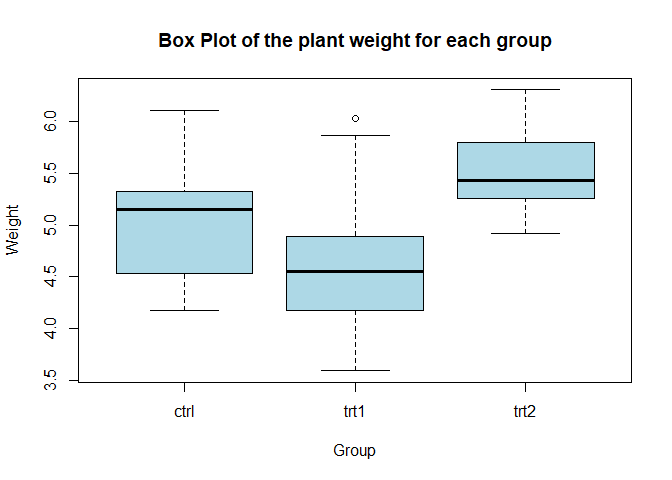
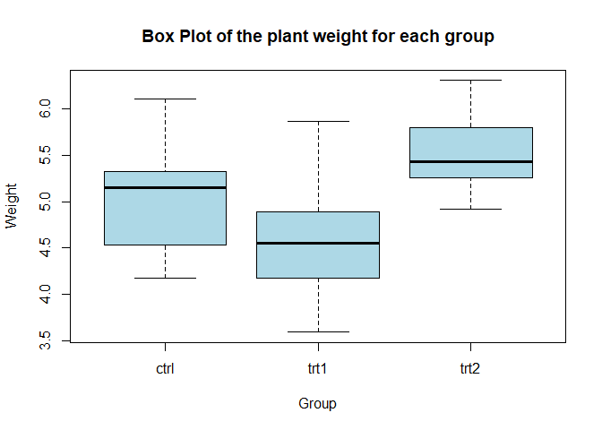

Formative Assessment 7
================
Ramilo, Zion John Yousef T.

**Dataset and Content**

Results from an experiment to compare yields (as measured by dried
weight of plants) obtained under a control and two different treatment
conditions.Wherein we need to know if there is significant differences
between the means of our different groups.

**Assuption Checks** Assumption 1: You have one dependent variable that
is measured at the continuous level.

``` r
head(PlantGrowth)
```

    ##   weight group
    ## 1   4.17  ctrl
    ## 2   5.58  ctrl
    ## 3   5.18  ctrl
    ## 4   6.11  ctrl
    ## 5   4.50  ctrl
    ## 6   4.61  ctrl

**Remark:** Given the data shown above our independent variable are the
different groups that the experiment has and the weight is the dependent
variable where weight is measured at a continous level.

Assumption 2: You have one independent variable that consists of two
categorical, independent groups.

``` r
unique(PlantGrowth$group)
```

    ## [1] ctrl trt1 trt2
    ## Levels: ctrl trt1 trt2

**Remark:** Given by the values above we can observe that there are 3
distinct values for the group feature where we have “ctrl” the control
group, “trt1” the treatment group 1, “trt2” the treatment group 2.
Therefore, assumption 2 is satisfied by the data provided.

Assumption 3: You should have independence of observations.

**Remark:** Based on the given data there are no direct relationships
between the levels within the groups therefore assumption 3 is
satisfied.

Assumption 4: There should be no significant outliers in the three or
more groups of your independent variable in terms of the dependent
variable.

``` r
boxplot(weight ~ group, data = PlantGrowth,
        main = "Box Plot of the plant weight for each group",
        xlab = "Group",
        ylab = "Weight",
        col = "lightblue")
```

<!-- -->
**Remark:** We can observe that the group for “trt1” contains a
significant outlier, however we have a dilemma wherein we cannot
necessaryly remove them since each group has the same number of plants
wieghted. To avoid Type I and Type 2 errors we can Winsorize the outlier
such that it will have the value equated to the nearest non-outlier
value.

``` r
PlantGrowth[17,"weight"] <- 5.87
boxplot(weight ~ group, data = PlantGrowth,
        main = "Box Plot of the plant weight for each group",
        xlab = "Group",
        ylab = "Weight",
        col = "lightblue")
```

<!-- -->
With Winsorize Assumption 4 is satisfied.

Assumption 5: Your dependent variable should be approximately normally
distributed for each group of the independent variable.

``` r
ShapiroWilkTest <- PlantGrowth %>%
  group_by(group) %>%
  summarise(
    shapiro_statistic = shapiro.test(weight)$statistic,
    shapiro_pValue = shapiro.test(weight)$p.value
  )
ShapiroWilkTest
```

    ## # A tibble: 3 × 3
    ##   group shapiro_statistic shapiro_pValue
    ##   <fct>             <dbl>          <dbl>
    ## 1 ctrl              0.957          0.747
    ## 2 trt1              0.925          0.403
    ## 3 trt2              0.941          0.564

**Remark:** Since the p-value for each group is normal by our large
p-values, therefore the the dependent variable for each group is
normally distributed, hence assumption 5 is satisfied.

Assumption 6: You have homogeneity of variances (i.e., the variance of
the dependent variable is equal in each group of your independent
variable).

``` r
LeveneTest <- PlantGrowth %>%
  group_by(group) %>%
  reframe(
    leveneStatistic = leveneTest(weight ~ group, data = .)$`F value`,
    levene_pValue = leveneTest(weight ~ group, data = .)$`Pr(>F)`
  )
LeveneTest
```

    ## # A tibble: 6 × 3
    ##   group leveneStatistic levene_pValue
    ##   <fct>           <dbl>         <dbl>
    ## 1 ctrl             1.05         0.365
    ## 2 ctrl            NA           NA    
    ## 3 trt1             1.05         0.365
    ## 4 trt1            NA           NA    
    ## 5 trt2             1.05         0.365
    ## 6 trt2            NA           NA

**Remark:** Given by the p-value of the levene’s test for each groups we
can determine that the variances of the dependent variable are equal
across all groups.Therefore homogeneity of variance is true.

**Descriptive Statistics**

``` r
describe(PlantGrowth$weight)
```

    ## PlantGrowth$weight 
    ##        n  missing distinct     Info     Mean  pMedian      Gmd      .05 
    ##       30        0       28        1    5.068     5.09   0.8047    3.983 
    ##      .10      .25      .50      .75      .90      .95 
    ##    4.170    4.550    5.155    5.530    5.894    6.132 
    ## 
    ## lowest : 3.59 3.83 4.17 4.32 4.41, highest: 5.8  5.87 6.11 6.15 6.31

Since our dataset passed all assumptions of the One-way ANOVA we can
perform the test.

H_0: There is no significant difference on weight between treatment
groups H_1: There is a significant difference of weight on at least one
of the treatment groups

``` r
anova_result <- aov(weight ~ group, data = PlantGrowth)
summary(anova_result)
```

    ##             Df Sum Sq Mean Sq F value Pr(>F)  
    ## group        2   3.90  1.9499   5.225 0.0121 *
    ## Residuals   27  10.08  0.3732                 
    ## ---
    ## Signif. codes:  0 '***' 0.001 '**' 0.01 '*' 0.05 '.' 0.1 ' ' 1

Given by the p-value we can reject our null hypothesis, therefore we can
say that there exist significant difference in means between the three
groups.

**Post-Hoc Test** Perform using tukeys

``` r
anova_result <- aov(weight ~ group, data = PlantGrowth)
tukey <- TukeyHSD(anova_result)
tukey
```

    ##   Tukey multiple comparisons of means
    ##     95% family-wise confidence level
    ## 
    ## Fit: aov(formula = weight ~ group, data = PlantGrowth)
    ## 
    ## $group
    ##             diff        lwr       upr     p adj
    ## trt1-ctrl -0.387 -1.0644067 0.2904067 0.3467958
    ## trt2-ctrl  0.494 -0.1834067 1.1714067 0.1860233
    ## trt2-trt1  0.881  0.2035933 1.5584067 0.0089327

By the post-hoc test shows that only the comparison between trt2 and
trt1 are significant differences whilst the other comparisons are non-
significant.
