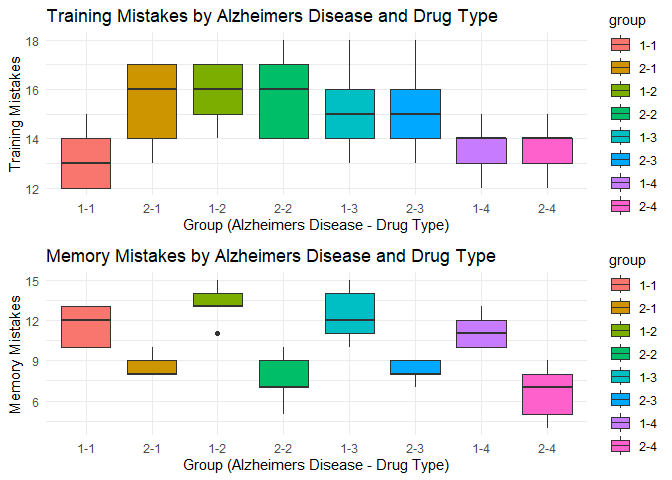

Statistics Summative Assessment 2
================
Ramilo, Zion John Yousef
2024-12-15

``` r
library(readr)
data <- read_csv("Alzheimers_Mice_Data.csv")
```

    ## Rows: 40 Columns: 4
    ## ── Column specification ────────────────────────────────────────────────────────
    ## Delimiter: ","
    ## dbl (4): AD_Status, Treatment, Training, Memory
    ## 
    ## ℹ Use `spec()` to retrieve the full column specification for this data.
    ## ℹ Specify the column types or set `show_col_types = FALSE` to quiet this message.

``` r
head(data)
```

    ## # A tibble: 6 × 4
    ##   AD_Status Treatment Training Memory
    ##       <dbl>     <dbl>    <dbl>  <dbl>
    ## 1         1         1       12     10
    ## 2         1         1       15     12
    ## 3         1         1       13     13
    ## 4         1         1       12     10
    ## 5         1         1       14     13
    ## 6         1         2       15     13

Assumptions for Two-Way ANOVA:

Assumption \#1: You have one dependent variable that is measured at the
continuous level. **Remark**: Based on the given dataset there are 2
dependent variables however they will be measured seperately, these
variables are the mistakes made during training and mistakes made during
memory day, to which is represented as an ordinal data; counting the
number of mistakes made by the mice, which entails that the two
variables are of continous levels.

Assumption \#2: You have two independent variable that consists of two
or more categorical, independent groups. **Remark**: The independent
variables are the precence of Alzheimers within each mice and the second
independent vatriable is the treatment variable which represents what
type out of the four drug types each mice was injected with. These
entails that the second assumption of the two-way ANOVA is satisfied.

Assumption \#3: You should have independence of observations, which
means that there is no relationship between the observations in each
group of the independent variable or among the groups themselves.
**Remark:** Based on the description of the data the researchers
methodology is introducing two different kinds of mice where one is
genetically engineered to have the precence of Alzheimers while the
others are wild mice that was checked to have no presence of Alzheimers.
In addition the researchers was able to stratify each mice for each drug
treatments, thus satisfying the assumption of independent groups.

Assumption \#4: There should be no significant outliers in the three or
more groups of your independent variable in terms of the dependent
variable.

``` r
data$group = interaction(data$AD_Status,data$Treatment,sep="-")
plot1 <- ggplot(data, aes(x = group, y = Training, fill = group))+
  geom_boxplot()+
  theme_minimal()+
  labs(
    title = "Training Mistakes by Alzheimers Disease and Drug Type",
    x = "Group (Alzheimers Disease - Drug Type)",
    y = "Training Mistakes"
  )
plot2<- ggplot(data, aes(x = group, y = Memory, fill = group))+
  geom_boxplot()+
  theme_minimal()+
  labs(
    title = "Memory Mistakes by Alzheimers Disease and Drug Type",
    x = "Group (Alzheimers Disease - Drug Type)",
    y = "Memory Mistakes"
  )

grid.arrange(plot1, plot2, ncol = 1)
```

<!-- -->

``` r
data$Memory[10] <- 13
plot1 <- ggplot(data, aes(x = group, y = Training, fill = group))+
  geom_boxplot()+
  theme_minimal()+
  labs(
    title = "Training Mistakes by Alzheimers Disease and Drug Type",
    x = "Group (Alzheimers Disease - Drug Type)",
    y = "Training Mistakes"
  )
plot2<- ggplot(data, aes(x = group, y = Memory, fill = group))+
  geom_boxplot()+
  theme_minimal()+
  labs(
    title = "Memory Mistakes by Alzheimers Disease and Drug Type",
    x = "Group (Alzheimers Disease - Drug Type)",
    y = "Memory Mistakes"
  )

grid.arrange(plot1, plot2, ncol = 1)
```

<!-- -->
**Remark**: Thereseems to be a significant outlier wihtin the memory
observations for the mice without alzheimers and are subjected to the
drug type 2 however using the Winzorise Technique all interactions
between the individual groups does not contain any significant outliers,
to which satisfies the assumption of the fourth assumption of the
two-way ANOVA. In addition

Assumption \#5: Your dependent variable should be approximately normally
distributed for each group of the independent variable.

``` r
ShapiroWilkTest_training <- data %>%
  group_by(group) %>%
  summarise(
    shapiro_statistic = shapiro.test(Training)$statistic,
    shapiro_pValue = shapiro.test(Training)$p.value
  )
ShapiroWilkTest_memory <- data %>%
  group_by(group) %>%
  summarise(
    shapiro_statistic = shapiro.test(Memory)$statistic,
    shapiro_pValue = shapiro.test(Memory)$p.value
  )
combined_results <- bind_cols(
  ShapiroWilkTest_training,
  ShapiroWilkTest_memory %>% select(-group)
)
```

    ## New names:
    ## • `shapiro_statistic` -> `shapiro_statistic...2`
    ## • `shapiro_pValue` -> `shapiro_pValue...3`
    ## • `shapiro_statistic` -> `shapiro_statistic...4`
    ## • `shapiro_pValue` -> `shapiro_pValue...5`

``` r
combined_results
```

    ## # A tibble: 8 × 5
    ##   group shapiro_statistic...2 shapiro_pValue...3 shapiro_statistic...4
    ##   <fct>                 <dbl>              <dbl>                 <dbl>
    ## 1 1-1                   0.902              0.421                 0.803
    ## 2 2-1                   0.867              0.254                 0.771
    ## 3 1-2                   0.902              0.421                 0.771
    ## 4 2-2                   0.894              0.377                 0.953
    ## 5 1-3                   0.979              0.928                 0.952
    ## 6 2-3                   0.979              0.928                 0.881
    ## 7 1-4                   0.961              0.814                 0.902
    ## 8 2-4                   0.961              0.814                 0.952
    ## # ℹ 1 more variable: shapiro_pValue...5 <dbl>

**Remark**: Each group was subjected to a Shapiro-Wilk-Test to determine
whether or not the data was normally distributed, the table shows that
the p-values for the training observation (Shapiro p-value…3) was all
above 0.05 to which implies that we cannot reject the null hypothesis
which indicates normality for the training observation, for the memory
observations the p-value (Shapiro p-value…5) also is above 0.05 which
implies normality for the memory observations. Hence, the data satisfies
the assumption of normality.

Assumption \#6. You have homogeneity of variances (i.e., the variance of
the dependent variable is equal in each group of your independent
variable).

``` r
LeveneTest_training <- data %>%
  group_by(group) %>%
  reframe(
    leveneStatistic = leveneTest(Training ~ group, data = .)$`F value`,
    levene_pValue = leveneTest(Training ~ group, data = .)$`Pr(>F)`
  ) %>% 
  distinct(group, .keep_all = TRUE)
LeveneTest_memory <- data %>%
  group_by(group) %>%
  reframe(
    leveneStatistic = leveneTest(Memory ~ group, data = .)$`F value`,
    levene_pValue = leveneTest(Memory ~ group, data = .)$`Pr(>F)`
  ) %>% 
  distinct(group, .keep_all = TRUE)
```

``` r
# Test of Homogeneity of Variances (Levene's Test) on Training Observations
print(LeveneTest_training)
```

    ## # A tibble: 8 × 3
    ##   group leveneStatistic levene_pValue
    ##   <fct>           <dbl>         <dbl>
    ## 1 1-1             0.435         0.873
    ## 2 2-1             0.435         0.873
    ## 3 1-2             0.435         0.873
    ## 4 2-2             0.435         0.873
    ## 5 1-3             0.435         0.873
    ## 6 2-3             0.435         0.873
    ## 7 1-4             0.435         0.873
    ## 8 2-4             0.435         0.873

``` r
# Test of Homogeneity of Variances (Levene's Test) on Memory Observations 
print(LeveneTest_memory)
```

    ## # A tibble: 8 × 3
    ##   group leveneStatistic levene_pValue
    ##   <fct>           <dbl>         <dbl>
    ## 1 1-1              1.03         0.428
    ## 2 2-1              1.03         0.428
    ## 3 1-2              1.03         0.428
    ## 4 2-2              1.03         0.428
    ## 5 1-3              1.03         0.428
    ## 6 2-3              1.03         0.428
    ## 7 1-4              1.03         0.428
    ## 8 2-4              1.03         0.428

**Remark**: Based on the given tables of the memory and training
observations and using the Levene’s test to determine the data’s
homogeneity of variances has shown a p-value of greater than 0.05 to
which entails that for each observation there is equal variances.

Since the data and groups satisfys all assumptions of teh two-way ANOVA,
it is eligable for the hypothesis testing. Where we will define our null
hypothesis and alternative hypothesis to be the following:

H0: There is no significant interaction effect on Training Mistakes
between presence of Alzheimers Disease and drug type. H1: There is a
significant interaction effect on Training Mistakes between presence of
Alzheimers Disease and drug type.

Descriptives

``` r
summaryAD_status <- data %>% 
  group_by(AD_Status) %>% 
  reframe(
    count = n(),
    mean_train = mean(Training),
    sd_train = sd(Training),
    SE_train = sd(Training) / sqrt(length(Training)),
    CV_train = (sd(Training) / mean(Training)) * 100,
    mean_memory = mean(Memory),
    sd_memory = sd(Memory),
    SE_memory = sd(Memory) / sqrt(length(Memory)),
    CV_memory = (sd(Memory) / mean(Memory)) * 100
  )%>%
  pivot_longer(
    cols = c(mean_train, sd_train, SE_train, CV_train, mean_memory, sd_memory, SE_memory, CV_memory),
    names_to = "stat_type", 
    values_to = "stat_value"
  )

summaryTreatment <- data %>% 
  group_by(Treatment) %>% 
  reframe(
    count = n(),
    mean_train = mean(Training),
    sd_train = sd(Training),
    SE_train = sd(Training) / sqrt(length(Training)),
    CV_train = (sd(Training) / mean(Training)) * 100,
    mean_memory = mean(Memory),
    sd_memory = sd(Memory),
    SE_memory = sd(Memory) / sqrt(length(Memory)),
    CV_memory = (sd(Memory) / mean(Memory)) * 100
  )%>%
  pivot_longer(
    cols = c(mean_train, sd_train, SE_train, CV_train, mean_memory, sd_memory, SE_memory, CV_memory),
    names_to = "stat_type", 
    values_to = "stat_value"
  )

summaryInteraction <- data %>% 
  group_by(group) %>% 
  reframe(
    count = n(),
    mean_train = mean(Training),
    sd_train = sd(Training),
    SE_train = sd(Training) / sqrt(length(Training)),
    CV_train = (sd(Training) / mean(Training)) * 100,
    mean_memory = mean(Memory),
    sd_memory = sd(Memory),
    SE_memory = sd(Memory) / sqrt(length(Memory)),
    CV_memory = (sd(Memory) / mean(Memory)) * 100
  )%>%
  pivot_longer(
    cols = c(mean_train, sd_train, SE_train, CV_train, mean_memory, sd_memory, SE_memory, CV_memory),
    names_to = "stat_type", 
    values_to = "stat_value"
  )
```

``` r
print("Summary by AD Status")
```

    ## [1] "Summary by AD Status"

``` r
print(as.data.frame(summaryAD_status))
```

    ##    AD_Status count   stat_type stat_value
    ## 1          1    20  mean_train 14.4500000
    ## 2          1    20    sd_train  1.7312910
    ## 3          1    20    SE_train  0.3871284
    ## 4          1    20    CV_train 11.9812524
    ## 5          1    20 mean_memory 12.2000000
    ## 6          1    20   sd_memory  1.6733201
    ## 7          1    20   SE_memory  0.3741657
    ## 8          1    20   CV_memory 13.7157381
    ## 9          2    20  mean_train 15.0000000
    ## 10         2    20    sd_train  1.7770466
    ## 11         2    20    SE_train  0.3973597
    ## 12         2    20    CV_train 11.8469776
    ## 13         2    20 mean_memory  7.7500000
    ## 14         2    20   sd_memory  1.6181536
    ## 15         2    20   SE_memory  0.3618301
    ## 16         2    20   CV_memory 20.8794012

``` r
print("Summary by Treatment")
```

    ## [1] "Summary by Treatment"

``` r
print(as.data.frame(summaryTreatment))
```

    ##    Treatment count   stat_type stat_value
    ## 1          1    10  mean_train 14.3000000
    ## 2          1    10    sd_train  1.8885621
    ## 3          1    10    SE_train  0.5972158
    ## 4          1    10    CV_train 13.2067277
    ## 5          1    10 mean_memory 10.1000000
    ## 6          1    10   sd_memory  1.9692074
    ## 7          1    10   SE_memory  0.6227181
    ## 8          1    10   CV_memory 19.4971030
    ## 9          2    10  mean_train 15.8000000
    ## 10         2    10    sd_train  1.4757296
    ## 11         2    10    SE_train  0.4666667
    ## 12         2    10    CV_train  9.3400606
    ## 13         2    10 mean_memory 10.6000000
    ## 14         2    10   sd_memory  3.4705107
    ## 15         2    10   SE_memory  1.0974718
    ## 16         2    10   CV_memory 32.7406669
    ## 17         3    10  mean_train 15.2000000
    ## 18         3    10    sd_train  1.8135294
    ## 19         3    10    SE_train  0.5734884
    ## 20         3    10    CV_train 11.9311145
    ## 21         3    10 mean_memory 10.3000000
    ## 22         3    10   sd_memory  2.6687492
    ## 23         3    10   SE_memory  0.8439326
    ## 24         3    10   CV_memory 25.9101863
    ## 25         4    10  mean_train 13.6000000
    ## 26         4    10    sd_train  1.0749677
    ## 27         4    10    SE_train  0.3399346
    ## 28         4    10    CV_train  7.9041743
    ## 29         4    10 mean_memory  8.9000000
    ## 30         4    10   sd_memory  2.9230882
    ## 31         4    10   SE_memory  0.9243616
    ## 32         4    10   CV_memory 32.8436873

``` r
print("Summary by Interaction")
```

    ## [1] "Summary by Interaction"

``` r
print(as.data.frame(summaryInteraction))
```

    ##    group count   stat_type stat_value
    ## 1    1-1     5  mean_train 13.2000000
    ## 2    1-1     5    sd_train  1.3038405
    ## 3    1-1     5    SE_train  0.5830952
    ## 4    1-1     5    CV_train  9.8775794
    ## 5    1-1     5 mean_memory 11.6000000
    ## 6    1-1     5   sd_memory  1.5165751
    ## 7    1-1     5   SE_memory  0.6782330
    ## 8    1-1     5   CV_memory 13.0739232
    ## 9    2-1     5  mean_train 15.4000000
    ## 10   2-1     5    sd_train  1.8165902
    ## 11   2-1     5    SE_train  0.8124038
    ## 12   2-1     5    CV_train 11.7960403
    ## 13   2-1     5 mean_memory  8.6000000
    ## 14   2-1     5   sd_memory  0.8944272
    ## 15   2-1     5   SE_memory  0.4000000
    ## 16   2-1     5   CV_memory 10.4003162
    ## 17   1-2     5  mean_train 15.8000000
    ## 18   1-2     5    sd_train  1.3038405
    ## 19   1-2     5    SE_train  0.5830952
    ## 20   1-2     5    CV_train  8.2521549
    ## 21   1-2     5 mean_memory 13.6000000
    ## 22   1-2     5   sd_memory  0.8944272
    ## 23   1-2     5   SE_memory  0.4000000
    ## 24   1-2     5   CV_memory  6.5766705
    ## 25   2-2     5  mean_train 15.8000000
    ## 26   2-2     5    sd_train  1.7888544
    ## 27   2-2     5    SE_train  0.8000000
    ## 28   2-2     5    CV_train 11.3218632
    ## 29   2-2     5 mean_memory  7.6000000
    ## 30   2-2     5   sd_memory  1.9493589
    ## 31   2-2     5   SE_memory  0.8717798
    ## 32   2-2     5   CV_memory 25.6494588
    ## 33   1-3     5  mean_train 15.2000000
    ## 34   1-3     5    sd_train  1.9235384
    ## 35   1-3     5    SE_train  0.8602325
    ## 36   1-3     5    CV_train 12.6548579
    ## 37   1-3     5 mean_memory 12.4000000
    ## 38   1-3     5   sd_memory  2.0736441
    ## 39   1-3     5   SE_memory  0.9273618
    ## 40   1-3     5   CV_memory 16.7229366
    ## 41   2-3     5  mean_train 15.2000000
    ## 42   2-3     5    sd_train  1.9235384
    ## 43   2-3     5    SE_train  0.8602325
    ## 44   2-3     5    CV_train 12.6548579
    ## 45   2-3     5 mean_memory  8.2000000
    ## 46   2-3     5   sd_memory  0.8366600
    ## 47   2-3     5   SE_memory  0.3741657
    ## 48   2-3     5   CV_memory 10.2031711
    ## 49   1-4     5  mean_train 13.6000000
    ## 50   1-4     5    sd_train  1.1401754
    ## 51   1-4     5    SE_train  0.5099020
    ## 52   1-4     5    CV_train  8.3836428
    ## 53   1-4     5 mean_memory 11.2000000
    ## 54   1-4     5   sd_memory  1.3038405
    ## 55   1-4     5   SE_memory  0.5830952
    ## 56   1-4     5   CV_memory 11.6414329
    ## 57   2-4     5  mean_train 13.6000000
    ## 58   2-4     5    sd_train  1.1401754
    ## 59   2-4     5    SE_train  0.5099020
    ## 60   2-4     5    CV_train  8.3836428
    ## 61   2-4     5 mean_memory  6.6000000
    ## 62   2-4     5   sd_memory  2.0736441
    ## 63   2-4     5   SE_memory  0.9273618
    ## 64   2-4     5   CV_memory 31.4188505

``` r
print("Training observation")
```

    ## [1] "Training observation"

``` r
anova_result <- aov(Training ~ AD_Status * Treatment, data = data)
anova_result_summary <- summary(anova_result)
print(anova_result_summary)
```

    ##                     Df Sum Sq Mean Sq F value Pr(>F)
    ## AD_Status            1   3.03   3.025   1.010  0.322
    ## Treatment            1   3.64   3.645   1.217  0.277
    ## AD_Status:Treatment  1   5.45   5.445   1.817  0.186
    ## Residuals           36 107.86   2.996

``` r
eta_squared_training <- eta_squared(anova_result)
print("Partial Eta-Squared for Training:")
```

    ## [1] "Partial Eta-Squared for Training:"

``` r
print(eta_squared_training)
```

    ## # Effect Size for ANOVA (Type I)
    ## 
    ## Parameter           | Eta2 (partial) |       95% CI
    ## ---------------------------------------------------
    ## AD_Status           |           0.03 | [0.00, 1.00]
    ## Treatment           |           0.03 | [0.00, 1.00]
    ## AD_Status:Treatment |           0.05 | [0.00, 1.00]
    ## 
    ## - One-sided CIs: upper bound fixed at [1.00].

``` r
print("Memory observation")
```

    ## [1] "Memory observation"

``` r
anova_result_memory <- aov(Memory ~ AD_Status * Treatment, data = data)
anova_result_memory_summary <- summary(anova_result_memory)
print(anova_result_memory_summary)
```

    ##                     Df Sum Sq Mean Sq F value   Pr(>F)    
    ## AD_Status            1 198.02  198.02  75.662 2.24e-10 ***
    ## Treatment            1   7.60    7.60   2.906   0.0969 .  
    ## AD_Status:Treatment  1   1.13    1.13   0.430   0.5162    
    ## Residuals           36  94.22    2.62                     
    ## ---
    ## Signif. codes:  0 '***' 0.001 '**' 0.01 '*' 0.05 '.' 0.1 ' ' 1

``` r
eta_squared_memory <- eta_squared(anova_result_memory)
print("Partial Eta-Squared for Memory:")
```

    ## [1] "Partial Eta-Squared for Memory:"

``` r
print(eta_squared_memory)
```

    ## # Effect Size for ANOVA (Type I)
    ## 
    ## Parameter           | Eta2 (partial) |       95% CI
    ## ---------------------------------------------------
    ## AD_Status           |           0.68 | [0.52, 1.00]
    ## Treatment           |           0.07 | [0.00, 1.00]
    ## AD_Status:Treatment |           0.01 | [0.00, 1.00]
    ## 
    ## - One-sided CIs: upper bound fixed at [1.00].

**Remark**:

Training Observations:

For the training observations the precense of Alzheimers Disease,
F(1,36) = 1.010, p= 0.322, had no significant difference on the outcome
of mistakes for the training observation regardless whether ir not a
mice has Alzheimers Disease. With an $\eta^2=0.03$ shows a small effect
size which implies only 3% of the variance in the training observations
can be explained.

Treatment, F(1,36) = 1.217, p= 0.277, also has shown no significance,
which implies that regardless of drug type there would be no difference
in the outcome of the training observations. With an $\eta^2=0.03$ shows
a small effect size which implies only 3% of the variance in the
training observations can be explained.

The interaction with the tratment and precense of the Alzheimers Disease
on mice have shown, F(1,36) = 1.817, p= 0.187, also has shown no
significance, which implies that there exist no signifiact effect of the
precense of the Alzheimers Disease and Drug type on determining the
number of mistakes within the training observations.With an
$\eta^2=0.05$ shows a negligable effect size which implies only 5% of
the variance in the training observations can be explained.

Memory Observations:

For the memory observations the precense of Alzheimers Disease, F(1,36)
= 75.662, p= 2.24e-10, was very significant in difference on the outcome
of mistakes for the memory observation. With an $\eta^2=0.68$ shows a
large effect size which implies that 68% of the variance in the memory
observations can be explained.

Treatment, F(1,36) = 2.906, p= 0.097, also has shown no significance,
which implies that regardless of drug type there would be no difference
in the outcome of the memory observations. With an $\eta^2=0.07$ shows a
small effect size which implies only 7% of the variance in the memory
observations can be explained.

The interaction with the treatment and precense of the Alzheimers
Disease on mice have shown, F(1,36) = 0.430, p= 0.516, also has shown no
significance, which implies that there exist no signifiact effect of the
precense of the Alzheimers Disease and Drug type on determining the
number of mistakes within the memory observations.With an $\eta^2=0.01$
shows a negligable effect size which implies only 1% of the variance in
the memory observations can be explained.
